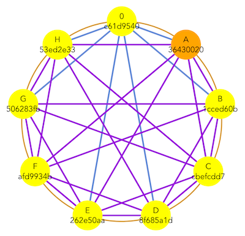
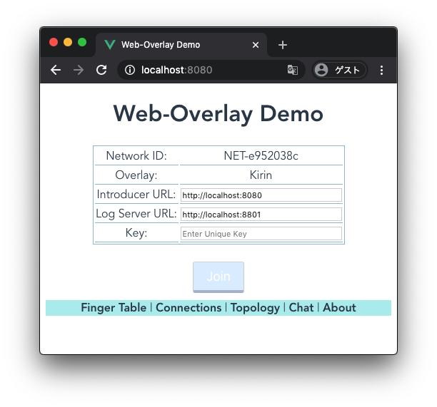
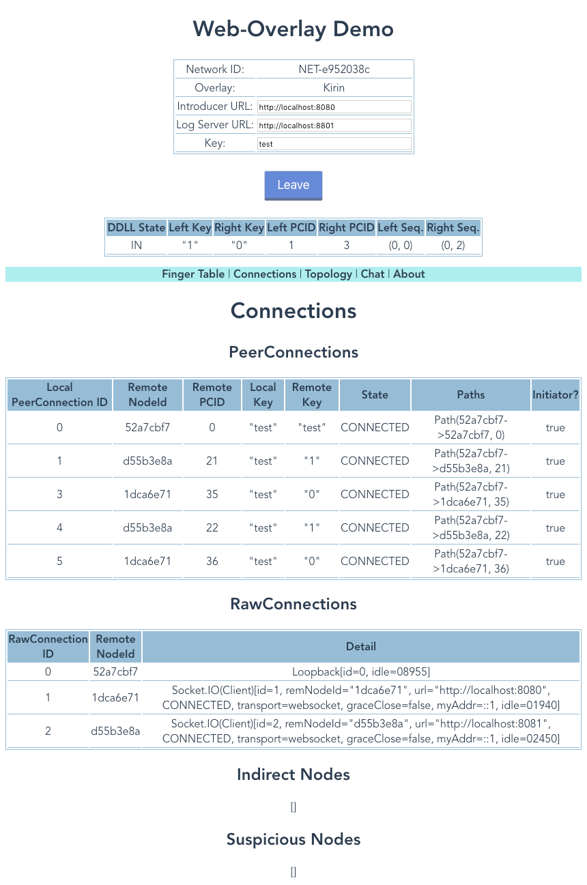
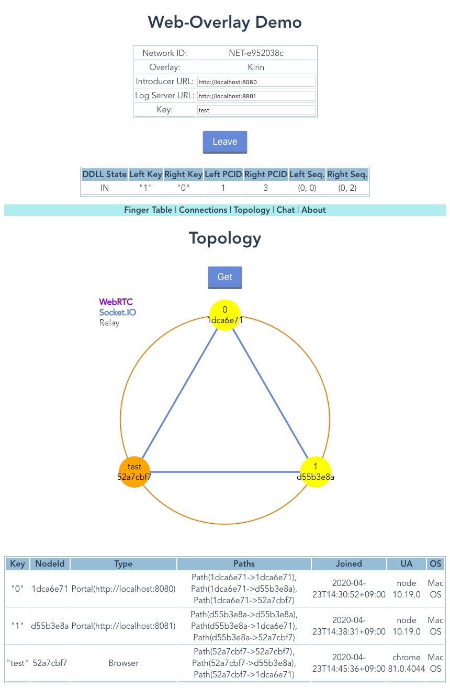

# Web-Overlay



*Web-Overlay* is a software for Web-based overlay network,
where each node is either a Web browser or a Node.js.
WebRTC and WebSocket (actually [Socket.io](https://socket.io/)) connections are used for interconnect.   
  
Web-overlay includes a connection manager and structured overlay network, *Kirin*.

Note that this software is quite experimental and not matured.   

## Build

You need a Node.js installed on your computer.  

Get the source code (This software is not yet exported as a npm package).

```
git clone https://github.com/abelab/web-overlay.git
```

Install [lerna](https://lerna.js.org/) locally. 
```
npm install
```

Fetch dependencies
```
npx lerna bootstrap
```

Transpile from TypeScript
```
npx lerna run build
```

## Documents

Not yet available

## Play with Demo

In the following setup, all nodes must be on the same host.

### Start an initial node (Node.js)

```bash
cd web-overlay/packages/demo
env DEPLOYMENT=localhost8080-initial npm run portal
```

Your initial node should start with following-like output.
```
Run as the initial portal node
- NETWORK_ID: NET-b4bbd842
- LOG_SERVER_URL: http://localhost:8801
- OVERLAY: kirin
- MY_URL: http://localhost:8080
- DEBUG: DEBUG:*
- HTTP ROOT: ..../packages/demo/dist
starting portal node...
initInitialNode succeeded
started: NodeId=cc348211, URL=http://localhost:8080
Command list: status, leave, quit, enable, disable
Prompt>
```

### Join your Web browser 

Access to http://localhost:8080 with your Web browser. 
Enter some key and push Join button.  If everything goes well,
your browser will join to an overlay network.
You can join multiple browsers (or multiple windows/tabs) to the network.



## Screenshots
Click items on the cyan stripe to show some information.  

### Finger tables


### Connections 


### Topology


### Primitive Chat


## Acknowledgements
This work was supported by JSPS KAKENHI Grant Number 16K00135.